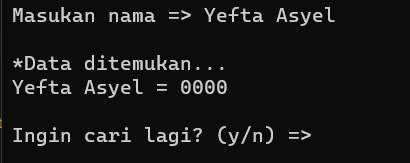

# TUGAS STRUKTUR DATA - SEARCHING

<h2>Demo</h2>

<h2>Overview</h2>

<h4>Halaman Awal</h4>

<h4>Opsi 1 - Tampilkan Data Buku Telepon</h4>

Berisi data buku telepon. Saat program pertama kali di run, data belum diisi sehingga bernilai <b>kosong</b>. Pada Halaman ini juga terdapat 3 opsi.

<ol>
    <li>Tambahkan Data</li>
    <li>Hapus Data</li>
    <li>Kembali ke Menu Awal</li>
</ol>

<h4>Opsi 2 - Cari Nama -> Telepon</h4>

Berguna untuk mencari data nomor telepon dengan cara menginputkan data nama

<h4>Opsi 3 - Cari Telepon -> Nama</h4>

Berguna untuk mencari data nama dengan cara menginputkan  data nomor telepon

<h4>Opsi 4 - Credit (anggota kelompok)</h4>

Berisi info dari anggota kelompok 5 dari mata kuliah struktur data kelas H. Disini juga terdapat opsi untuk melihat <i>source code</i> dari program ini pada halaman GitHub.

<h4>Opsi 5 - Keluar</h4>

Keluar dari program.

